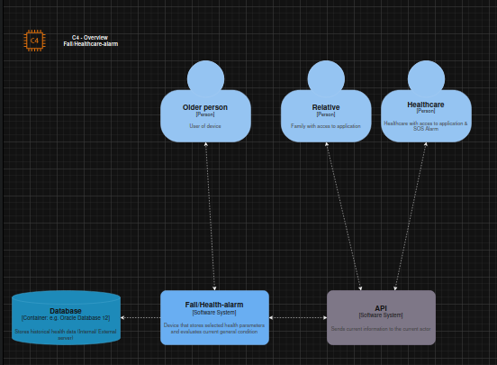
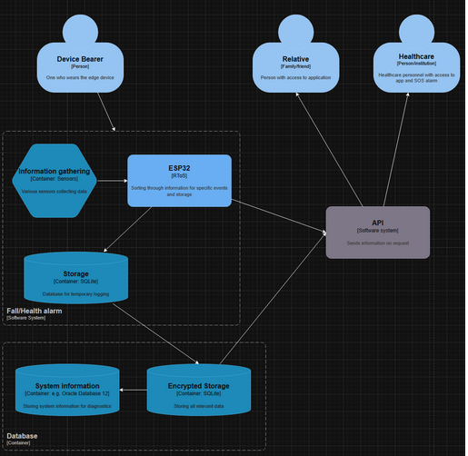
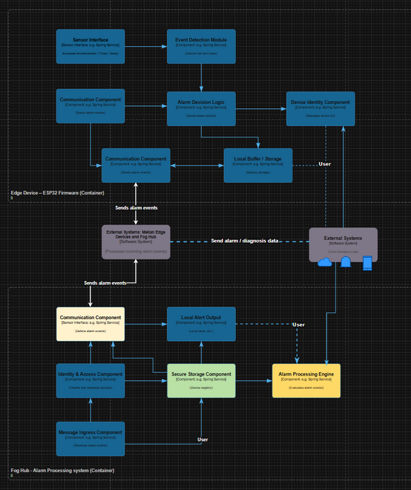
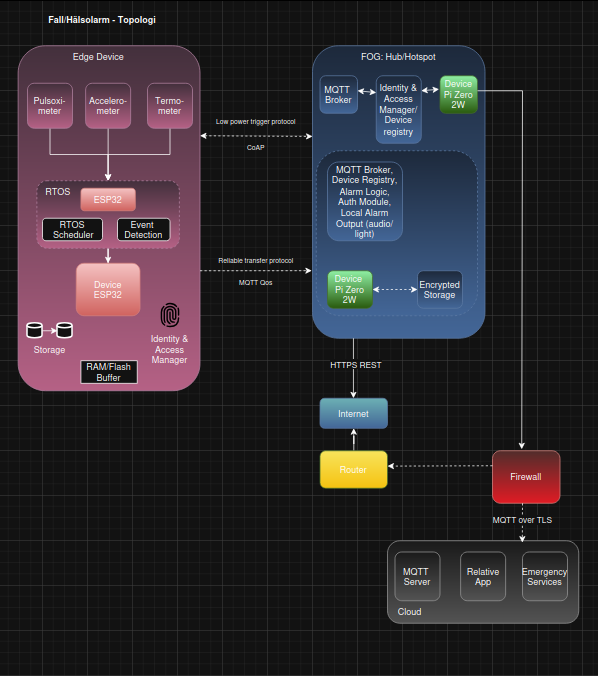
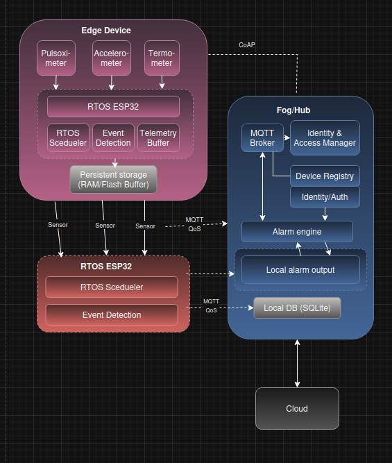
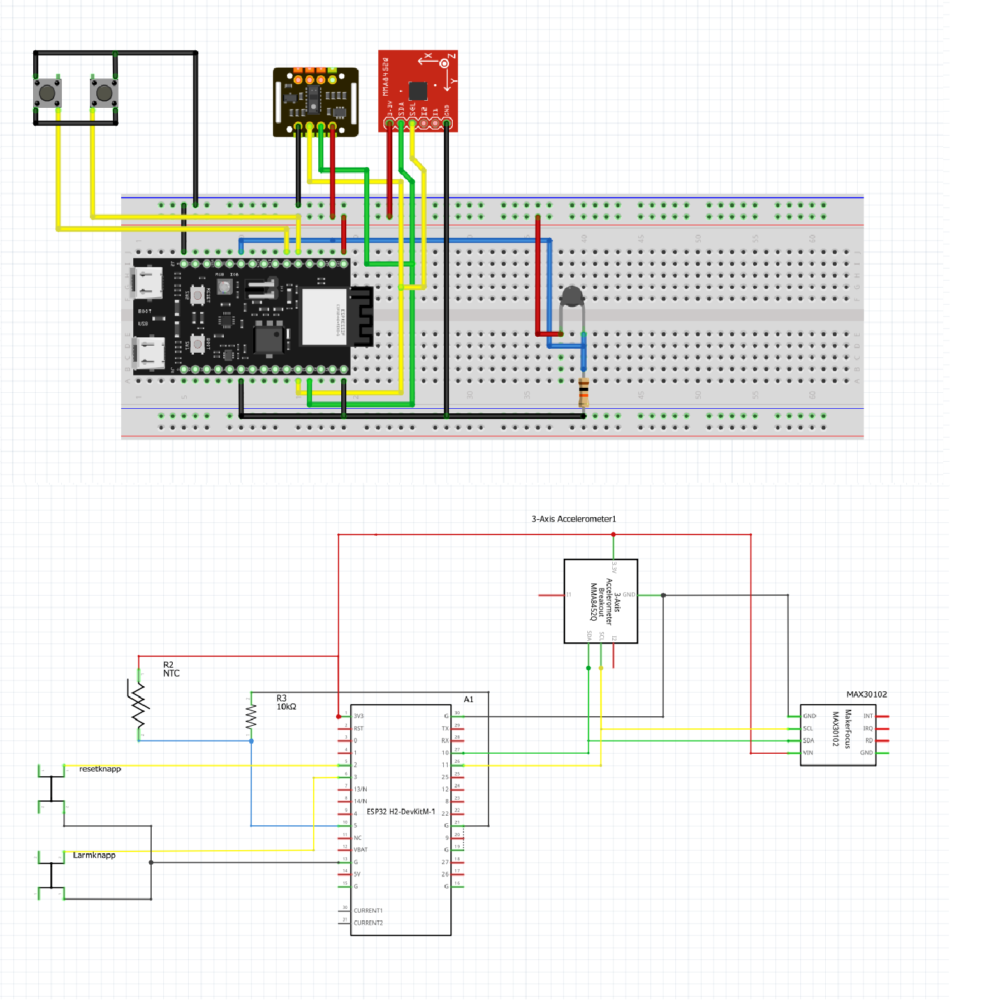

## Systemarkitektur

### Översikt
Systemet består av en edge-device (armband),
en lokal gateway och molntjänster.

### C4 - Context 

 

### Nätverkstopologi

  

### Komponentdiagram

### Kopplingsdiagram

 

